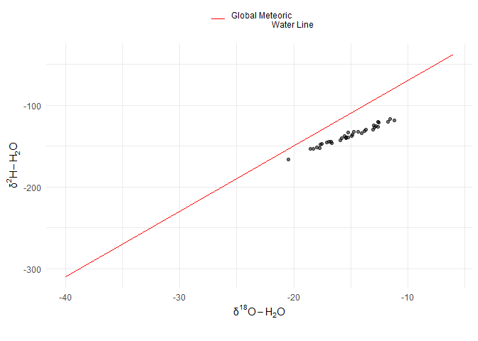

________________________________________________________________________________
## 1.) Loading Things: \
### 1.1: Loading Packages \
Load in any and all packages required to manipulate, transform, and illustrate the data given.

```r
#Functional:
library(tidyverse)     #Package to process our data, stylized formation
```

```
## Warning: package 'tidyverse' was built under R version 4.3.2
```

```
## Warning: package 'ggplot2' was built under R version 4.3.3
```

```
## Warning: package 'purrr' was built under R version 4.3.2
```

```
## Warning: package 'forcats' was built under R version 4.3.2
```

```
## ── Attaching core tidyverse packages ──────────────────────── tidyverse 2.0.0 ──
## ✔ dplyr     1.1.3     ✔ readr     2.1.4
## ✔ forcats   1.0.0     ✔ stringr   1.5.0
## ✔ ggplot2   3.5.0     ✔ tibble    3.2.1
## ✔ lubridate 1.9.2     ✔ tidyr     1.3.0
## ✔ purrr     1.0.2     
## ── Conflicts ────────────────────────────────────────── tidyverse_conflicts() ──
## ✖ dplyr::filter() masks stats::filter()
## ✖ dplyr::lag()    masks stats::lag()
## ℹ Use the conflicted package (<http://conflicted.r-lib.org/>) to force all conflicts to become errors
```

```r
library(dplyr)         #Sub tidyverse package for data manipulation 
library(magrittr)      #Package to help coding sequencing 
```

```
## 
## Attaching package: 'magrittr'
## 
## The following object is masked from 'package:purrr':
## 
##     set_names
## 
## The following object is masked from 'package:tidyr':
## 
##     extract
```

```r
library(janitor)       #Package for 'clean_names()' function
```

```
## Warning: package 'janitor' was built under R version 4.3.2
```

```
## 
## Attaching package: 'janitor'
## 
## The following objects are masked from 'package:stats':
## 
##     chisq.test, fisher.test
```

```r
library(readr)         #Package to help parse rectangular data
library(stringr)       #Package to deal w/ NAs and manipulate cols/data
library(lubridate)     #Package for date processing and plotting
library(broom.mixed)   #Package to clean diverse model outputs
#Aesthetics:
library(ggplot2)       #Package to generate plotted data
library(patchwork)     #Package for extensive plotted data configuration
```

```
## Warning: package 'patchwork' was built under R version 4.3.2
```

```r
library(ggthemes)      #Package for extra themes, scales, and geoms for plotted data
```

```
## Warning: package 'ggthemes' was built under R version 4.3.2
```

```r
library(RColorBrewer)  #Package to colour plots
library(viridis)       #Package to colour plots
```

```
## Loading required package: viridisLite
```

```
## Warning: package 'viridisLite' was built under R version 4.3.2
```

```r
library(here)          #Package to set working directory via `.Rproj`
```

```
## here() starts at C:/Users/jkoza/Documents/GRADUATE SCHOOL/2. COURSEWORK/GG606/GG606_Lecture_engagement
```

```r
getwd()                #Function to affirm working directory 
```

```
## [1] "C:/Users/jkoza/Documents/GRADUATE SCHOOL/2. COURSEWORK/GG606/GG606_Lecture_engagement"
```

### 1.2: Loading Data \

The raw water isotope excel workbook (.xslx) provided to us contains three separate spreadsheets: Sample Info, Trendline, and Chemistry. 
The last spreadsheet, 'Chemistry' seems to be missing data from an internal workbook reference. There is no additional data included, nor are there any other formulas which are dependent on these references. It has been eliminated from this assignment. \
The second spreadsheet, 'Trendline' has... a lot going on: a.) it includes a plot of 2H vs. 18O data that cannot be rendered within R and b.) it plots the respective 18O and 2H data (VSMOW  ± 0.2‰ and VSMOW  ± 0.8‰, respectively) from the 'Sample Info' spreadsheet. The Global Meteoric Line values correspond to the known linear relationship(s) between theses two parameters. Since these values can be taken from within the 'Sample Info' spreadsheet, this spreadsheet is the only one which has been converted to a `.csv` and used here. 


________________________________________________________________________________
## 2.) Cleaning Data: \

Upon loading the data in, I was able to see what RStudio did with it, then went from there. Comments of steps denoted below. 

```r
wiso_data=wiso_data %>%                        #overwrite previous defined object 
  clean_names() %>%                                            #clean col headers
  select(sample, date, lab_number,result_7,repeat_8, result_10, repeat_11) %>%
  slice(2:36) %>%                                            #only keep these rows
  rename(sample_id=sample) %>%                                   #change col title
  mutate(date="2022-06-30") %>% #we kinda know this is the sample date from excel sheet
  mutate(date=as.Date(date, format="%Y-%m-%d"))#thought this would fix knit w/ `print()`
```

I needed to break up the cleaning code chunk in order for it to load and recognize my commands properly. For example, when trying to input a value into a newly changed column title, sometimes the new column title had not yet been registered within the environment and thus could not recognize the code command. 

```r
#This is where I need to figure out how to merge the 18o and 2H data... 
wiso_data=wiso_data %>%                   #overwrite previous defined object
#Altering col titles to reflect actual data inside of them... must be careful that we are actually giving the correct titles to corresponding data. Beware. 
  rename("18O_result"=result_7) %>%
  rename("18O_repeat"=repeat_8) %>%
  rename("2H_result"=result_10) %>%
  rename("2H_repeat"=repeat_11) %>%
#  mutate(VSMOV_type=case_when(isotope_result_type=="18O_result"~"±0.2‰",
#                              isotope_result_type=="2H_result"~"±0.8‰", TRUE~NA))
  mutate(`18O_result`=as.numeric(`18O_result`),   #when trying to plot later realized
         `2H_result`=as.numeric(`2H_result`)) #%>%     
#To be honest, I don't know why these columns wouldn't mutate when using normal double quotation marks, had to use single back tick quotation like when plotting... idk?
#print(wiso_data)  #for some reason I could not get the file to knit w/ this function
```

In future I would probably also advise myself to not combine so much elaborate data frame code changes within one chunk, just because changing one line can seriously affect the output or there is less risk involved in breaking the code. Resetting the environment each time is only *soo* much fun, but note to then make good new object names.

________________________________________________________________________________
## 3.) Graphing Things: \

**2. Summarize the data with a plot of δ18O-H2O (x axis) vs δ2H-H2O (y axis). Draw on the Global Meteoric Water Line (δ2H = 8.0 × δ18O + 10‰). This is the most common plot to begin visualizing these types of data. [2 marks]** \
- I manually inputted the GML values into the plot, in keeping with what the company did whether that be right or (mostly) wrong. 18O: x -6 and -40 // 2H: y -38 and -310 \
- If we wanted we could have made R calculate this and then input our results onto the figure (good for if we need to do lots of these) but keeping in the sprit of the bare minimum, here is our lovely plot: 

```r
wiso_data_plot=wiso_data %>%                            #create callable object
#Generate the plot:
  ggplot() +
  geom_point(aes(x=`18O_result`, y=`2H_result`, alpha=0.5)) +
  scale_x_continuous(limits=c(-40,-6)) +               #adjust plot x-axis limits 
  scale_y_continuous(limits=c(-310,-38)) +                    #to match GML range
  geom_segment(aes(x=-40, y=-310, xend=-6, yend=-38, colour="Global Meteoric 
                   Water Line")) + #draw GML
#Edit the scales:
  theme_minimal() +
  scale_color_manual(values="red") +
  guides(alpha=FALSE) +
#Generate label titles: 
  theme(legend.position="top") +
  labs(x=expression(atop(δ^{18}*O - H[2]*O)),                     
       y=expression(δ^{2}*H - H[2]*O),
      colour="")
```

```
## Warning: The `<scale>` argument of `guides()` cannot be `FALSE`. Use "none" instead as
## of ggplot2 3.3.4.
## This warning is displayed once every 8 hours.
## Call `lifecycle::last_lifecycle_warnings()` to see where this warning was
## generated.
```

```r
print(wiso_data_plot)                     #View object created appears properly
```

```
## Warning in geom_segment(aes(x = -40, y = -310, xend = -6, yend = -38, colour = "Global Meteoric \n                   Water Line")): All aesthetics have length 1, but the data has 35 rows.
## ℹ Did you mean to use `annotate()`?
```

<!-- -->

________________________________________________________________________________
## 4.) Conclusion: \

### 4.1: Lecture Engagenment Question(s) \
**1. Were you successful in importing and cleaning the data? Comment on two places where you were tripped up. [3 marks]** \
- Yes. Data ended up being cleaned and plotted. \
- Firstly, I needed to observe the initial condition of the excel workbook prior to converting and uploading the data into RStudio, since this would give me a better idea of what form the data needed to be manipulated into. It definitely took me a hot second to understand what was going on, so the first thing that I would say tripped me up was understanding the data presented in the form it was and knowing what actually could be used in RStudio. \
- Secondly, thinking about how to get the data types and values into a single column took my brain a moment to also render. Some lines of code seem redundant, but they help keep me organized in understanding what I've done and can easily be removed if I no longer want them. One thing that was a red flag was someone incorrectly (?) inputting the date as June 31, 2022 when June only has 30 days. This could be an input error, or is maybe why only June 2022 is used in the date column here. I don't know. \
- I accidentally `pivot_longer`ed everything then couldn't graph 18O by 2H lol (code in 'code_scraps.Rmd' file). Getting the VSMOV values to display correctly tripped me up since result values were already displaying kinda twice because of the `repeat_type` column but it's not too too big of a deal, so whatever. Fixed that with a `case_when()` slap in which theeeen had to be removed again because I un-`pivoted_longer` everything. AH. In another day I would've spent more time trying to get those values in the data frame.\


### 4.2: Closing Comments: \
- Took a hot second to figure out what the hell was in that excel workbook, but overall data was actually not too bad to clean and transform. What's shocking is how... unprofessional that entire workbook appears, especially if that was returned to a paying customer. \
- To be honest, I hated this. Thought of Wilke the whole time too. 
